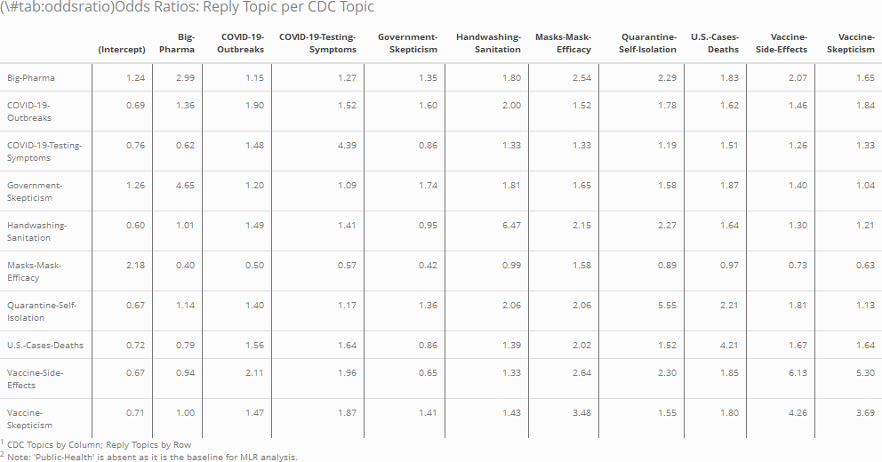

# Appendix

The following appendix provides much of the R code used in this study.

## Tables and Figures


\tiny
```{r convID, echo = F}
tweets_conversation <- readRDS("conversation_long_2.RDS") %>% 
  dplyr::filter(conversation_id == "1440058230260916237") %>% 
  dplyr::rename(
    "Count" = "value",
    # "Conversation-ID" = "conversation_id",
    # "CDC-Topic" = "label_CDC",
    # "Reply-Topic" = "label_Reply"
  )


convID.kable <- knitr::kable(tweets_conversation, escape = T, format = "latex", caption = "Example of Tweets aggregated by conversation ID") %>% 
  kableExtra::kable_styling(latex_options = c("HOLD_position"))

convID.kable
```

```{r oddsratio, echo = FALSE}

conversation_long$label_CDC <- relevel(conversation_long$label_CDC, ref = "Public-Health")
conversation_long$label_Reply <- relevel(conversation_long$label_Reply, ref = "Public-Health")

oddsratio <- exp(coef(mlr)) %>%
  as.data.frame()
names <-
  c(
    "Intercept",
    "Big-Pharma",
    "COVID-Outbreaks",
    "COVID-Testing",
    "Government-Skeptic",
    "Sanitation",
    "Masks",
    "Distancing",
    "US-Cases",
    "Vaccine-Effects",
    "Vaccine-Skeptic"
  )
# colnames(oddsratio) <- names
colnames(oddsratio) <-
  str_remove(colnames(oddsratio), pattern = "label_CDC")

oddskable <- knitr::kable(
  oddsratio,
  format = "latex",
  digits = 2,
  caption = "Odds Ratios: Reply Topic per CDC Topic",
)  %>%
  # column_spec(1:12, border_left = T, border_right = T) %>%
  kable_styling( full_width = T,
    latex_options = c("repeat_header",
                      # "scale_down",
                      "hold_position"),
  ) %>%
  add_footnote(
    notation = "number",
    label = c(
      "CDC Topics by Column; Reply Topics by Row",
      "Note: 'Public-Health' is absent as it is the baseline for MLR analysis."
    )
  ) %>% landscape()
oddskable


oddskable1 <- knitr::kable(
  oddsratio[,1:5],
  format = "latex",
  digits = 2,
  caption = "Odds Ratios: Reply Topic per CDC Topic",
  # longtable = T,
  # booktabs = T
)  %>%
  # column_spec(1:6, border_left = T, border_right = T) %>%
  kable_styling( full_width = T,
    latex_options = c("repeat_header",
                      # "scale_down",
                      "hold_position"),
  )# %>%
  # add_footnote(
  #   notation = "number",
  #   label = c(
  #     "CDC Topics by Column; Reply Topics by Row",
  #     "Note: 'Public-Health' is absent as it is the baseline for MLR analysis."
  #   )
  # )
# oddskable1

oddskable2 <- knitr::kable(
  oddsratio[,6:11],
  format = "latex",
  digits = 2,
  # longtable = T,
  # booktabs = T
)  %>%
  # column_spec(1:6, border_left = T, border_right = T) %>%
  kable_styling( full_width = T,
    latex_options = c("repeat_header",
                      # "scale_down",
                      "hold_position"),
  ) %>%
  add_footnote(
    notation = "number",
    label = c(
      "CDC Topics by Column; Reply Topics by Row",
      "Note: 'Public-Health' is absent as it is the baseline for MLR analysis."
    )
  )
# oddskable2


# kableExtra::save_kable(oddskable, file = "odds.png")
# 
```


\normalsize
\twocolumn

## academictwitteR


\tiny
```{r academic, eval = F}

date.start <- "2019-01-01T00:00:00Z"
date.end <- "2021-09-21T00:00:00Z"

get_all_tweets(
  users = c("CDCgov"),
  start_tweets = date.start,
  end_tweets = date.end,
  n = Inf,
  data_path = "CDCtweets/",
  bind_tweets = F
)

get_all_tweets(
  query = "@CDCgov",
  start_tweets = date.start,
  end_tweets = date.end,
  n = Inf,
  data_path = "ReplyTweets/",
  bind_tweets = F
)

```

\normalsize

## Latent Dirichlet Allocation


\tiny
```{r LDA, eval = F}
library(textmineR)

# Read in Tweets acquired from academictwitteR::get_all_tweets()


tweets_full <- read_csv(
  "tweets_full.csv",
  col_types = cols(tweet_id = col_character(),
                   conversation_id = col_character())
)

# Filter Tweets by English language and select only necessary columns

tweets_filter <- tweets_full %>% 
  filter(lang == "en") %>% 
  select(
    tweet_id, conversation_id, text
  )

# Listing Twitter-specific stopwords
t.stopwords <- c("amp", "$", "RT")

# Create a Document-Term Matrix of 1- and 2-grams
# Also, this step removes stopwords and lemmaticizes the data
tweets_DTM <- CreateDtm(
    doc_vec = tweets_filter$text,
    doc_id = tweets_filter$tweet_id,
    ngram_window = c(1,2),
    stopword_vec = c(
      stopwords::stopwords(language = "en"),
      stopwords::stopwords(source = "smart"),
      t.stopwords
    ),
    stem_lemma_function = function(x){
      SnowballC::wordStem(words = x, language = "porter")
    },
    remove_punctuation = T,
    remove_numbers = T,
    # Convert to lower-case
    lower = T
  )


# Finally, generating the LDA Model

tweets_LDA <- FitLdaModel(
  dtm = tweets_DTM,
  k = 11,
  iterations = 1000,
  burnin = 500,
  calc_coherence = T,
  
  # These parameters should be optimized in the publication run; this model
  # takes a lot of time to process so the values are kept at default.
  alpha = .1,
  beta = .05
)

# Create a dataframe based on the theta parameter by tweet_id
theta <- as.data.frame(tweets_LDA$theta) %>% 
  rownames_to_column("tweet_id")


# Joining theta to tweets_filter gives us a distribution of topics per Tweet
tweets.LDA <- inner_join(tweets_filter, theta)


# This function allows for a programmatic labeling of each topic, rather than try
# and label these manually (and induce bias!)
LDA.summary <- SummarizeTopics(LDA)


# Making some of the topics a bit more legible; the names are still based off of
# the top terms generated by `SummarizeTopics`
topic.names <- tibble(
  labels = c(
    "american_people",
    "big_pharma",
    "covid_-",
    "covid_vaccine",
    "natural_immunity",
    "public_health",
    "stay_home",
    "tested_positive",
    "united_states",
    "wash_hands",
    "wear_mask"
  ),
  names = c(
    "Government-Skepticism",
    "Big-Pharma",
    "COVID-19-Outbreaks",
    "Vaccine-Side-Effects",
    "Vaccine-Skepticism",
    "Public-Health",
    "Distancing",
    "COVID-19-Testing",
    "U.S.-Cases-Deaths",
    "Sanitation",
    "Masks"
  )
)
topic.names.c <-
  setNames(as.character(topic.names$names),
           topic.names$labels)


# Recoding the LDA Summary to include the more legible names
LDA.summary <- LDA.summary %>% 
  dplyr::mutate(
    Topic_Name = recode(label_1,
                       !!!topic.names.c) %>% 
      factor(ordered = F)
  ) %>% arrange(Topic_Name)

# Just a simple table of topic and topic names, for recoding later data
topic.description <- LDA.summary %>% 
  select(
    topic, Topic_Name
  )

# This function calculates the most significant topic by finding the maximum
# value of theta for each Tweet.
tweets.LDA$max.topic <-
  colnames(tweets.LDA[, 4:14])[max.col(tweets.LDA[, 4:14])]

# Same as above, but returns the actual value of theta; not really used in the
# analysis, but good to see just for reference
tweets.LDA$max.theta <- apply(tweets.LDA[, 4:14], 1, max)


# Applying the LDA model to Tweets made by the CDC; this is a major shortcoming
# of this analysis, and is something I'd like to fix before publication. Some
# changes include actually generating a *separate* LDA model unique to CDC
# Tweets, as the topics they discuss are very different than those of the
# general population.

# Loading the .csv with readr...
tweets_CDC <- readr::read_csv("tweets_cdc.csv") %>% 
  dplyr::select(tweet_id, text, conversation_id)

# Fitting the LDA model requires a DTM
CDC_DTM <- CreateDtm(
  doc_vec = tweets_CDC$text,
  doc_names = tweets_CDC$tweet_id,
  ngram_window = c(1, 2),
  stopword_vec = c(
    stopwords::stopwords(language = "en"),
    stopwords::stopwords(source = "smart"),
    t.stopwords
  ),
  stem_lemma_function = function(x) {
    SnowballC::wordStem(words = x, language = "porter")
  },
  remove_punctuation = T,
  remove_numbers = T,
  lower = T
)


# Predicting CDC Topics based on original LDA; again, this is something that
# will change in the final version of this paper.
CDC_topics <- predict(object = tweets_LDA,
                      newdata = CDC_DTM)

# For brevity, I won't include all the following steps, because they're
# essentially the same as what was done for the Reply Tweets
```


```{r conversation, eval = F}
# Tweets were grouped by conversation_id. Unfortunately, the original file
# containing the actual analysis has been lost, but the process of grouping
# by conversation_id is roughly the same as follows:


# "CDC_topics" and "Reply_topics" are dataframes of tweet_id, 
# conversation_id, and topic
tweets_conversation <- CDC_topics %>% 
  left_join(Reply_topics, by = "conversation_id")

# Below is an example of what the grouped dataframe looks like for a single
# conversation_id. The "count" column indicated how many Reply Tweets of a
# Reply Topic are in that conversation
```

\normalsize

## Multinomial Logistic Regression

\tiny
```{r mlr, eval = F}
mlr <- conversation_long %>%
  dplyr::filter(
    # Filtered out rows where no Reply Tweets of a topic were found.
    value > 0
  ) %>% 
  multinom(
    # label_CDC (CDC Topic) is the only independent variable in this
    # case, but the results are weighted by `value`, or the count of 
    # Reply Tweets of different Topics (Count column in the example
    # table above)
    formula = label_Reply ~ label_CDC, 
    weights = value,
    data = .)

# Calculate the Odds Ratio from the Coefficients from MLR.
odds <- exp(coef(mlr)) %>% 
  as.data.frame()
```
