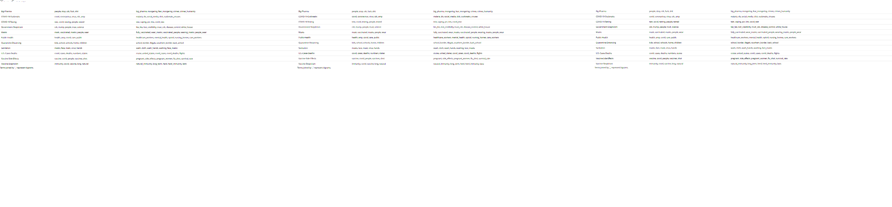

# Methodology

## Topic Modeling

Topic modeling is a powerful tool set within the field of text mining that allows the user to extract a set of "topics" which occur within a set of documents (i.e. a *corpus*). These topics are based primarily on word co-occurrence; that is, words that appear frequently together are more likely to be assigned to the same topic. For example, because words such as "mask" and "mandate" frequently co-occur as bigrams in discussions on health and sanitation, they are likely to be assigned to the same topic; see table \@ref(tab:topicsummary) for the top 5 terms within each topic. For this analysis, the topic modeling method used is *Latent Dirichlet Allocation*, which allows for documents to be categorized into more than one topic; see Section \@ref(latent-dirichlet-allocation) for more detail.

```{r topicsummary, echo = F}

topic.kable <- LDA_Summary %>% 
  dplyr::select(Topic_Name, top_terms_phi) %>% 
  knitr::kable(caption = "Top 5 terms within each topic",format = "latex",
               col.names = c("Topic", "Top Terms ($\\phi$)")) %>% add_footnote("Terms joined by '_' represent bigrams.", notation = "none")# %>% 
  # kable_styling(latex_options = c("hold_position",
  #                                 "scale_down"))

topic.kable
# topic.kable %>% kableExtra::save_kable("topics_table.png")

# topic.kable %>% save_kable("topics_table.png")
# 
```

### Constructing Corpus
A corpus is defined as a collection of documents for use in text mining; in this case it is the collection of Tweets obtained from the `academictwitteR` package, which were cleaned using the methods described in Section \@ref(data-preprocessing). This corpus was stored within R as a `data.frame` object, which contained information such as text, the date at which the Tweet was written (`created_at`), the unique ID (`tweet_id`), conversation id (`conversation_id`), and many others.


### Document-Term Matrix

### Latent Dirichlet Allocation

Latent Dirichlet Allocation (hereafter *LDA*), developed in @blei2003, is an unsupervised machine-learning approach to topic modeling, in which topics are assigned through "fuzzy clustering" into different subsets of topics. Rather than in "hard clustering" algorithms such as hierarchical or k-means clustering, where documents consist of only a single topic, *LDA* assigns a distribution of topics to each document. For example, a Tweet discussing effectiveness of the COVID-19 vaccines may be classified as .81 (81%) Topic 1 ("vaccines"), .10 (10%) Topic 2 ("government"), etc., to a sum of 1 (i.e., documents have some proportion of *all* topics, but usually fall into one or two topics, based on the parameter alpha ($\alpha$)).

One of the foundations of *LDA* is the *Dirichlet Distribution*, a "distribution of distribution" modeled by several parameters outlined below:

#### *K*


#### Alpha ($\alpha$)

#### Beta ($\beta$)

#### Phi ($\phi$) and Gamma ($\gamma$)

#### Theta ($\theta$)

#### *Iterations*


## Analysis

### Topic Name Assignment.

A descriptive name for each topic was generated with the `textmineR::SummarizeTopics` function, which automatically assigns each topic a label based on most prevalent terms. The outcome of this function was then "cleaned up" and given proper capitalization and punctuation for legibility purposes. This function was used to aid in eliminating potential researcher bias in arbitrarily assigning names to topics.

Note should be taken regarding the topics "Big-Pharma", "Government-Skepticism", and "Vaccine-Skepticism", specifically in how these topics are applied to CDC Tweets. As the CDC does not intentionally promote skepticism towards the efficacy of mask-wearing and vaccines, these topics warrant further examination. CDC Tweets of these topics are primarily artefacts of how *LDA* was used in this analysis; these are largely Tweets that either do not clearly fall into topics regarding public health and mask-wearing, or were authored pre-COVID, when much of the discourse consisted of  regulatory information ("vaping," food-related recalls, etc.).

### Multinomial Logistic Regression

The primary method of regression analysis for this study was *multinomial logistic regression*, a method capable of modeling the predicted response of a categorical dependent variable with more than two possible outcomes (i.e. non-binary). 

Using the `multinom` function from the `nnet` R package, multinomial logistic regression was calculated on each *conversation id*. **...explain `conversation_long` etc...**. This function requires a "baseline" explanatory and response variable, which was chosen to be the "Public-Health" topic.